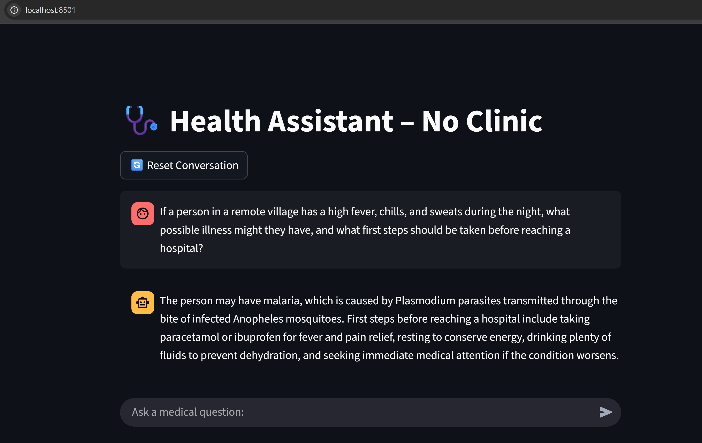

# 🩺 MEDICAL-LLAMA-CHATBOT

This project is a **medical chatbot** built with **Ollama + Streamlit + FAISS**, designed to provide question–answering based on the open-source book *“Where There Is No Doctor”*.  

🔹 At first, the chatbot used **LLaMA-3:8B**, but since it was too large and slow on CPU, we switched to a **quantized model (`nous-hermes:7b-llama2-q4_K_M`)** for faster inference while still keeping good quality.  
🔹 Everything runs **locally** — no paid GPU or API required.  

---

## 🖼️ Demo UI

<p align="center" style="margin: 40px 0;">
  
</p>


## 📂 Project Structure

The file structure of the **MEDICAL-LLAMA-CHATBOT** project is as follows:

# medical-chatbot-with-llama
```medical-llama-chatbot/
├── configs/
│   └── config.yml
├── notebooks/
│   └── exploration.ipynb
├── src/
│   ├── data_loader/
│   │   └── pdf_loader.py
│   ├── embeddings/
│   │   └── vector_store.py
│   ├── models/
│   │   └── llama_wrapper.py
│   ├── qa/
│   │   ├── pipeline.py
│   │   └── retriever.py
│   ├── utils/
│   │   └── logger.py
│   └── main.py
├── requirements.txt
└── README.md
```

---

## ⚙️ Features

- 🔍 **Retrieval-Augmented Generation (RAG)** pipeline with FAISS embeddings  
- 📖 Knowledge grounded in *Where There Is No Doctor*  
- ⚡ Optimized for **CPU-only machines** using quantized LLaMA-2 model  
- 💬 **Streamlit chat UI** with conversation memory  
- 📝 Easy to extend with new documents  


---

##  Installation & Setup

```
# 1. Clone the repository
git clone https://github.com/IdreesAh809/medical-chatbot-with-llama.git
cd medical-chatbot-with-llama

# 2. Create environment & Install dependencies
pip install -r requirements.txt

# 3. Install Ollama and pull the quantized model
ollama pull nous-hermes:7b-llama2-q4_K_M

# 4. Run the Streamlit app
streamlit run src/main.py
```
